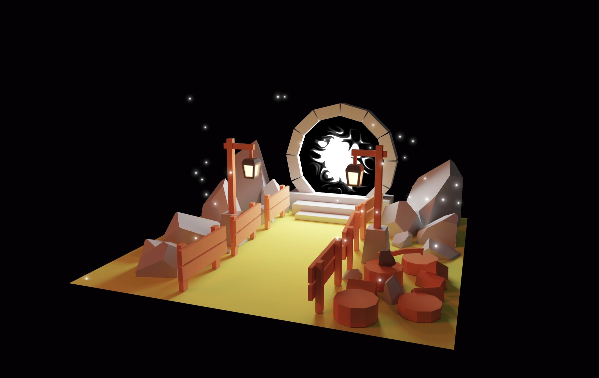

# 🌀 Three.js Portal Scene with React Three Fiber  

## **Project Overview**
This project showcases a 3D portal scene built using **React Three Fiber**. The 3D assets were created in **Blender** and integrated into the React environment, demonstrating a visually appealing and interactive 3D scene. The project was completed as part of my learning journey in a Three.js course.


---

## **Features**
- 🌌 **Blender-Created Assets**: A custom-designed 3D environment including rocks, lamps, fences, and a glowing portal.
- 🚀 **React Three Fiber**: Utilizes the React Three Fiber library to render the Blender-created models seamlessly in a React application.
- ✨ **Interactive Scene**: Smooth rendering, optimized for real-time performance.
- 🔗 **Portal Animation**: The glowing portal adds a magical and immersive experience.

---

## **Tech Stack**
- **React**: Front-end library for building the UI.
- **Three.js**: 3D graphics rendering library.
- **React Three Fiber**: React wrapper for Three.js.
- **Blender**: 3D modeling and asset creation tool.

---


### **Installation**
1. Clone this repository:
   ```bash
   git clone https://github.com/psaemiyan/threejs-projects.git

2. Navigate to the project directory:
    ```bash
    cd portal-scene

3. Install dependencies:
    ```bash
    npm install

4. Start the development server:
    ```bash
    npm run dev 